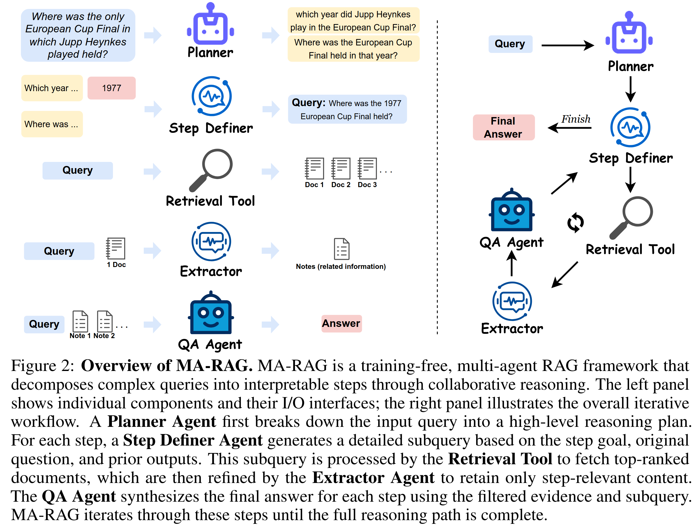

# MA-RAG: Multi-Agent Retrieval-Augmented Generation via Collaborative Chain-of-Thought Reasoning

This repository contains the source code for the paper:  
[MA-RAG: Multi-Agent Retrieval-Augmented Generation via Collaborative Chain-of-Thought Reasoning](https://arxiv.org/abs/2505.20096).



---

## 🔧 Installation

To set up the environment, install the required dependencies using the `requirements.txt` file:

```bash
pip install -r requirements.txt
```

---

## ⚙️ Environment Configuration

Before running any experiments, set up your OpenAI API key and model name in a `.env` file:

```env
OPENAI_API_KEY=your_openai_api_key_here
MODEL_NAME=gpt-4o
```

You can either export them manually or use a `.env` loader.

---

## 🧪 Steps to Run the Experiment

### Step 1: Embed the Corpus

Run the following command to embed the corpus:

```bash
python corpus/embed_corpus.py
```

### Step 2: Run the Main Experiment

Execute the main experiment with the following command:

```bash
python main.py --model gpt4omini --dataset hotpotqa --exp plan_rag_extract --gpus 0 1
```

---

## 📚 Citation

If you use this code, please cite the paper:

```bibtex
@article{marag2025,
      title={MA-RAG: Multi-Agent Retrieval-Augmented Generation via Collaborative Chain-of-Thought Reasoning}, 
      author={Thang Nguyen, Peter Chin, Yu-Wing Tai},
      year={2025},
      journal={arXiv preprint arXiv:2505.20096},
}
```